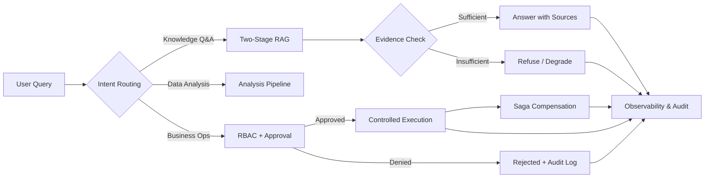

# 👋 Hi, I'm Zhenkun

> **AI 应用工程师 · Python 后端开发者** 
> **AI Application Engineer · Python Backend Developer**

---

## 🧭 关于我 · About Me

我专注于把 LLM 应用与 Agent 系统做成**可靠的产品**：路由、权限与副作用边界可审计；RAG 回答可追溯、可评测；后端行为用测试与指标证明。我习惯亲手走完「设计 → 实现 → 测试 → 上线」的完整链路，并把关键决策沉淀为仓库里的自动化测试、CI 检查与部署资产——**让代码自己讲述它的可靠性**。

I focus on turning LLM applications and agent systems into **reliable products**: auditable routing, permissions, and side-effect boundaries; RAG answers that are traceable and evaluable; backend behavior proven by tests and metrics. I walk the full path — design → implementation → testing → shipping — and encode every key decision into automated tests, CI checks, and deployment assets, **so the code tells its own reliability story**.

工作中我熟练运用 **Vibe Coding**——以 AI 编码助手为第一生产力，用自然语言驱动「设计 → 实现 → 测试 → 上线」的全流程，并深度使用 **Codex、Claude Code、Cursor、Kimi、DeepSeek** 等多模型组合，按任务特性灵活切换。我始终带着**产品化意识**做工程：不满足于「能跑」，而是追求可维护、可测试、可交付、真正被用户用起来。

In practice I'm fluent in **Vibe Coding** — AI coding assistants as the primary driver across design → implementation → testing → shipping — working hands-on with a multi-model stack (**Codex, Claude Code, Cursor, Kimi, DeepSeek**) chosen per task. I bring a **product mindset** to engineering: code that merely runs isn't the bar; it must be maintainable, testable, shippable, and usable by real people.

---

## 🚀 作品精选 · Selected Work

### 🏢 [BusinessAgent · 智多星](https://github.com/zhenkun26/BusinessAgent)

- **价值 · Value**：面向企业知识问答、数据分析和受控业务操作的多 Agent 工作流系统——回答有据可查、操作有审批、执行有审计。
  A multi-agent workflow system for enterprise knowledge Q&A, data analysis, and controlled operations — answers with sources, operations with approvals, execution with audit trails.
- **难点 · Challenges**：多 Agent 协作的落地难题——任务流转的显式编排、知识与数据双通道检索、高风险操作的审批与权限、跨环节失败的一致性补偿、故障时的优雅降级。
  Turning multi-agent orchestration into production — explicit workflow state machines, two-stage retrieval for knowledge and data, approvals and permissions for high-risk actions, consistent compensation when a step fails mid-chain, and graceful degradation.
- **落地 · Shipped**：[101 项自动化测试](https://github.com/zhenkun26/BusinessAgent/tree/main/enterprise-agent/tests)、[CI 安全检查](https://github.com/zhenkun26/BusinessAgent/actions/workflows/ci.yml)及部署与演练资产；外部 CRM/邮件通过模拟与契约方式接入，工单链路走通真实 HTTP 适配与沙箱验收。
  [101 automated tests](https://github.com/zhenkun26/BusinessAgent/tree/main/enterprise-agent/tests), [CI security scanning](https://github.com/zhenkun26/BusinessAgent/actions/workflows/ci.yml), and deployment & drill assets; CRM/email integrated via mocks and contract adapters, ticket flows verified end-to-end with real HTTP adapters and sandbox acceptance.

`Python` `FastAPI` `LangGraph` `Milvus` `PostgreSQL` `Redis` `OpenTelemetry`

---

### 🧳 [TripMate · 智能旅行助手](https://github.com/zhenkun26/TripMate)

- **价值 · Value**：基于高德候选数据生成结构化行程，预算估算、天气、地图、分享一站式输出。
  Structured itineraries from Amap candidate data — budget, weather, maps, and shareable output in one flow.
- **难点 · Challenges**：真实出行的工程问题——多数据源并行采集、AI 输出格式漂移的自动校验与修复、缓存与限流扛住突发流量、前后端契约保持一致。
  Real-world travel engineering — parallel fetching from multiple data sources, auto-validating and repairing AI output drift, cache and rate limits for traffic spikes, and keeping frontend-backend contracts in sync.
- **落地 · Shipped**：[后端与前端测试](https://github.com/zhenkun26/TripMate/tree/main/backend/tests)、[ruff + mypy strict + pytest + Vitest CI](https://github.com/zhenkun26/TripMate/actions/workflows/ci.yml)、前后端契约自动生成与 Docker Compose 一键启动。
  [Backend & frontend tests](https://github.com/zhenkun26/TripMate/tree/main/backend/tests), [ruff + mypy strict + pytest + Vitest CI](https://github.com/zhenkun26/TripMate/actions/workflows/ci.yml), auto-generated frontend-backend contracts, and one-command Docker Compose startup.

`Python` `FastAPI` `Vue 3` `TypeScript` `Pydantic` `Redis` `LLM Structured Output`

---

### ⚡ [FlashFlow · 闪电购](https://github.com/zhenkun26/FlashFlow)

- **价值 · Value**：专注限量抢购正确性的工程实验——从 MySQL 同步下单、Redis 抢购闸门、RocketMQ 消息化，到故障自愈的可靠发布，每个版本都验证同一件事：抢得再猛，账也不会错。
  A database-first flash-sale lab — from synchronous MySQL ordering and Redis admission gates to RocketMQ messaging and recoverable Outbox publication, each release proving one thing: under the heaviest rush, the books never break.
- **难点 · Challenges**：抢购背后的真实并发难题——四种扣库存策略同台对比（含一个故意留的错误对照组）、10 条账目铁律、高并发下的竞态与重复请求测试、消息丢失或积压后的自动恢复、异常消息的隔离兜底。
  The real concurrency puzzles behind flash sales — four inventory strategies compared head-to-head (including a deliberately unsafe control), ten hard bookkeeping rules, race and duplicate-request tests under contention, automatic recovery from lost or backlogged messages, and poison-message isolation.
- **落地 · Shipped**：[124 项自动化测试与逐版本验证报告](https://github.com/zhenkun26/FlashFlow/blob/main/docs/verification/current-status.md)——每个版本都先过完整测试与真实故障演练，再带着可复现的证据发布；如实标注实验室定位，不做生产容量承诺。
  [124 automated tests with dated verification reports](https://github.com/zhenkun26/FlashFlow/blob/main/docs/verification/current-status.md) — every release passes the full suite and live fault drills before shipping, backed by reproducible evidence; honestly scoped as a laboratory, with no production-capacity claims.

`Java 21` `Spring Boot` `MySQL/InnoDB` `Redis Lua` `RocketMQ` `Transactional Outbox` `Testcontainers` `k6`

---

## 🧬 BusinessAgent 工作流 · How It Works

**设计原则 · Design Principles**：权限边界先于执行、证据不足拒绝作答、副作用全程可回滚、每一步留下审计痕迹。
Permissions are enforced before execution, answers refuse on insufficient evidence, side effects stay compensable, and every step leaves an audit trail.

---

## 🧰 能力与落地 · Capabilities Delivered

| 能力域 · Capability | 技术与设计 · Tech & Design | 项目落地 · Shipped |
| --- | --- | --- |
| 🤖 Agent 工作流 · Agent Workflows | StateGraph, parallel fan-out, re-planning, tool gateway, Human-in-the-loop | [BusinessAgent](https://github.com/zhenkun26/BusinessAgent) |
| 📚 RAG 工程 · RAG Engineering | Milvus HNSW, BGE Reranker, source attribution, confidence-based decisions, retrieval fallback | [BusinessAgent](https://github.com/zhenkun26/BusinessAgent) |
| ⚙️ AI 应用集成 · AI App Integration | Structured output, external data constraints, SSE streaming, retry & fallback | [TripMate](https://github.com/zhenkun26/TripMate) · [Desktop-pet](https://github.com/zhenkun26/Desktop-pet) |
| 🐍 Python 后端 · Python Backend | FastAPI, Pydantic, JWT/RBAC, PostgreSQL, Redis, rate-limiting & idempotency | [BusinessAgent](https://github.com/zhenkun26/BusinessAgent) · [TripMate](https://github.com/zhenkun26/TripMate) |
| 🚦 限量下单正确性 · Limited-Stock Ordering | MySQL/InnoDB, Redis Lua admission, four inventory strategies, ten invariants, Transactional Outbox, deterministic race tests, real-RocketMQ recovery matrix | [FlashFlow](https://github.com/zhenkun26/FlashFlow) |
| 🛡️ 可靠性与交付 · Reliability & Delivery | Saga, task queues, audit logging, Metrics/Trace, CI, security scanning, containerization | [BusinessAgent](https://github.com/zhenkun26/BusinessAgent) |
| ✅ 工程质量 · Engineering Quality | pytest, Vitest, mypy strict, ruff, contract drift detection, adversarial fixtures | [TripMate](https://github.com/zhenkun26/TripMate) · [auto-coding](https://github.com/zhenkun26/auto-coding) |

---

## 🛠️ 工具与实验 · Tooling & Experiments

- **[auto-coding](https://github.com/zhenkun26/auto-coding)**：面向 AI 编码助手的风险感知交付 skill——按风险分级规划执行深度、结构级契约检查、中断后的安全恢复、CI 与版本发布。
  A risk-aware delivery skill for AI coding assistants — risk-graded planning, structural contract checks, safe recovery after interruptions, CI, and versioned releases.
- **[EquiRebuild](https://github.com/zhenkun26/EquiRebuild)**：Hermes 生态扩展实验——可配置的代码审查与加固 skill，经离线测试与并发演练验证。
  A Hermes ecosystem extension — a configurable code review and hardening skill, verified with offline tests and concurrent drills.

---

## 💡 我在乎的 · What I Care About

- ✅ 让 Agent 的路由、权限和副作用边界**可检查**，而不是依赖模型临场发挥。
  Making agent routing, permissions, and side-effect boundaries **auditable** — not left to model improvisation.
- 📚 让 RAG 回答**可追溯来源、可评测质量**，证据不足时明确拒答或降级。
  Making RAG answers **traceable and evaluable** — refusing or degrading clearly when evidence is insufficient.
- 🛡️ 让后端系统通过类型、测试、审计、指标与故障路径**证明可靠性**。
  Making backend systems **prove reliability** through types, tests, audit trails, metrics, and well-defined failure paths.

---

## 📫 联系 · Contact

正在寻找 **AI 应用工程 / Python 后端开发** 相关机会，也欢迎交流 Agent、RAG 与 AI 工程实践。

Open to **AI Application Engineering / Python Backend Development** roles — always happy to chat about agents, RAG, and AI engineering practice.

> *Keep building. Keep verifying. Let what's shipped speak.* 
> *持续构建，持续验证，让交付说话。*
