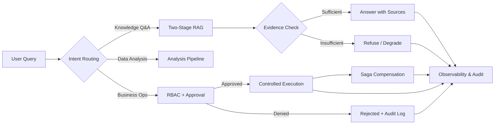

# 👋 Hi, I'm Zhenkun

> **AI 应用工程师 · Python 后端开发者** 
> **AI Application Engineer · Python Backend Developer**

---

## 🧭 关于我 · About Me

我专注于把 LLM 应用与 Agent 系统做成**可靠的产品**：路由、权限与副作用边界可审计；RAG 回答可追溯、可评测；后端行为用测试与指标证明。我习惯亲手走完「设计 → 实现 → 测试 → 上线」的完整链路，并把关键决策沉淀为仓库里的自动化测试、CI 检查与部署资产——**让代码自己讲述它的可靠性**。

I focus on turning LLM applications and agent systems into **reliable products**: auditable routing, permissions, and side-effect boundaries; RAG answers that are traceable and evaluable; backend behavior proven by tests and metrics. I walk the full path — design → implementation → testing → shipping — and encode every key decision into automated tests, CI checks, and deployment assets, **so the code tells its own reliability story**.

工作中我熟练运用 **Vibe Coding**——以 AI 编码助手为第一生产力，用自然语言驱动「设计 → 实现 → 测试 → 上线」的全流程，并深度使用 **Codex、Claude Code、Cursor、Kimi、DeepSeek** 等多模型组合，按任务特性灵活切换。我始终带着**产品化意识**做工程：不满足于「能跑」，而是追求可维护、可测试、可交付、真正被用户用起来。

In practice I'm fluent in **Vibe Coding** — AI coding assistants as the primary driver across design → implementation → testing → shipping — working hands-on with a multi-model stack (**Codex, Claude Code, Cursor, Kimi, DeepSeek**) chosen per task. I bring a **product mindset** to engineering: code that merely runs isn't the bar; it must be maintainable, testable, shippable, and usable by real people.

---

## 🚀 作品精选 · Selected Work

### 🏢 [BusinessAgent · 智多星](https://github.com/zhenkun26/BusinessAgent)

- **价值 · Value**：面向企业知识问答、数据分析和受控业务操作的多 Agent 工作流系统——回答有据可查、操作有审批、执行有审计。
  A multi-agent workflow system for enterprise knowledge Q&A, data analysis, and controlled operations — answers with sources, operations with approvals, execution with audit trails.
- **难点 · Challenges**：LangGraph 显式状态机、两阶段 RAG、RBAC 审批流、Saga 补偿、优雅降级与可观测性。
  LangGraph explicit state machines, two-stage RAG, RBAC approval flows, Saga compensation, graceful degradation, and observability.
- **落地 · Shipped**：[101 项自动化测试](https://github.com/zhenkun26/BusinessAgent/tree/main/enterprise-agent/tests)、[CI 安全检查](https://github.com/zhenkun26/BusinessAgent/actions/workflows/ci.yml)及部署与演练资产；外部 CRM/邮件以 Mock/契约适配为主，工单链路完成 HTTP 适配与 stub 沙箱验收。
  [101 automated tests](https://github.com/zhenkun26/BusinessAgent/tree/main/enterprise-agent/tests), [CI security scanning](https://github.com/zhenkun26/BusinessAgent/actions/workflows/ci.yml), and deployment & drill assets; CRM/email via mock/contract adapters, ticket workflows verified with HTTP adapters and stub sandbox acceptance.

`Python` `FastAPI` `LangGraph` `Milvus` `PostgreSQL` `Redis` `OpenTelemetry`

---

### 🧳 [TripMate · 智能旅行助手](https://github.com/zhenkun26/TripMate)

- **价值 · Value**：基于高德候选数据生成结构化行程，预算估算、天气、地图、分享一站式输出。
  Structured itineraries from Amap candidate data — budget, weather, maps, and shareable output in one flow.
- **难点 · Challenges**：并行外部数据采集、结构化输出校验与修复、Redis 缓存与限流、前后端契约同步。
  Parallel external data fetching, structured-output validation & repair, Redis caching/rate limiting, and frontend-backend contract sync.
- **落地 · Shipped**：[后端与前端测试](https://github.com/zhenkun26/TripMate/tree/main/backend/tests)、[ruff + mypy strict + pytest + Vitest CI](https://github.com/zhenkun26/TripMate/actions/workflows/ci.yml)、Pydantic → TypeScript 契约生成与 Docker Compose 启动链路。
  [Backend & frontend tests](https://github.com/zhenkun26/TripMate/tree/main/backend/tests), [ruff + mypy strict + pytest + Vitest CI](https://github.com/zhenkun26/TripMate/actions/workflows/ci.yml), Pydantic → TypeScript contract generation, and Docker Compose launch.

`Python` `FastAPI` `Vue 3` `TypeScript` `Pydantic` `Redis` `LLM Structured Output`

---

### ⚡ [FlashFlow · 闪电购](https://github.com/zhenkun26/FlashFlow)

- **价值 · Value**：数据库优先的闪电购实验室——从同步 MySQL 正确性、Redis Lua 准入、RocketMQ 消息化，到事务性 Outbox 的可恢复发布，逐版本验证高并发限量抢购的正确性边界。
  A database-first limited-stock ordering laboratory — evolving from synchronous MySQL correctness, Redis Lua admission, and RocketMQ messaging to recoverable Transactional Outbox publication, proving the correctness boundaries of high-concurrency ordering release by release.
- **难点 · Challenges**：四种库存策略对照（条件原子更新 / 悲观锁 / 乐观锁 / 不安全"先读后写"对照组）、10 条不变量、确定性竞态与幂等测试、真实 RocketMQ 故障矩阵与租约恢复、毒消息死信。
  Four inventory strategies side by side (conditional atomic update / pessimistic lock / optimistic lock / unsafe read-then-write control), ten invariants, deterministic race and idempotency tests, a live RocketMQ fault matrix with lease-based recovery, and poison-message dead letters.
- **落地 · Shipped**：[124 项自动化测试与逐版本验证报告](https://github.com/zhenkun26/FlashFlow/blob/main/docs/verification/current-status.md)——V4 干净修订通过完整套件与真实 RocketMQ 恢复矩阵，经 OpenSpec 严格校验与归档后发布；不做生产容量声明。
  [124 tests with dated verification reports](https://github.com/zhenkun26/FlashFlow/blob/main/docs/verification/current-status.md) — the clean V4 revision passed the full suite and the live RocketMQ recovery matrix, then shipped after OpenSpec strict validation and archiving; no production-capacity claim is made.

`Java 21` `Spring Boot` `MySQL/InnoDB` `Redis Lua` `RocketMQ` `Transactional Outbox` `Testcontainers` `k6`

---

## 🧬 BusinessAgent 工作流 · How It Works

**设计原则 · Design Principles**：权限边界先于执行、证据不足拒绝作答、副作用全程可回滚、每一步留下审计痕迹。
Permissions are enforced before execution, answers refuse on insufficient evidence, side effects stay compensable, and every step leaves an audit trail.

---

## 🧰 能力与落地 · Capabilities Delivered

| 能力域 · Capability | 技术与设计 · Tech & Design | 项目落地 · Shipped |
| --- | --- | --- |
| 🤖 Agent 工作流 · Agent Workflows | StateGraph, parallel fan-out, re-planning, tool gateway, Human-in-the-loop | [BusinessAgent](https://github.com/zhenkun26/BusinessAgent) |
| 📚 RAG 工程 · RAG Engineering | Milvus HNSW, BGE Reranker, source attribution, confidence-based decisions, retrieval fallback | [BusinessAgent](https://github.com/zhenkun26/BusinessAgent) |
| ⚙️ AI 应用集成 · AI App Integration | Structured output, external data constraints, SSE streaming, retry & fallback | [TripMate](https://github.com/zhenkun26/TripMate) · [Desktop-pet](https://github.com/zhenkun26/Desktop-pet) |
| 🐍 Python 后端 · Python Backend | FastAPI, Pydantic, JWT/RBAC, PostgreSQL, Redis, rate-limiting & idempotency | [BusinessAgent](https://github.com/zhenkun26/BusinessAgent) · [TripMate](https://github.com/zhenkun26/TripMate) |
| 🚦 限量下单正确性 · Limited-Stock Ordering | MySQL/InnoDB, Redis Lua admission, four inventory strategies, ten invariants, Transactional Outbox, deterministic race tests, real-RocketMQ recovery matrix | [FlashFlow](https://github.com/zhenkun26/FlashFlow) |
| 🛡️ 可靠性与交付 · Reliability & Delivery | Saga, task queues, audit logging, Metrics/Trace, CI, security scanning, containerization | [BusinessAgent](https://github.com/zhenkun26/BusinessAgent) |
| ✅ 工程质量 · Engineering Quality | pytest, Vitest, mypy strict, ruff, contract drift detection, adversarial fixtures | [TripMate](https://github.com/zhenkun26/TripMate) · [auto-coding](https://github.com/zhenkun26/auto-coding) |

---

## 🛠️ 工具与实验 · Tooling & Experiments

- **[auto-coding](https://github.com/zhenkun26/auto-coding)**：面向 AI 编码助手的风险感知交付 skill——风险路由、AST 契约检查、原子状态恢复、CI 与版本发布。
  A risk-aware delivery skill for AI coding assistants — risk routing, AST contract checks, atomic state recovery, CI, and versioned releases.
- **[EquiRebuild](https://github.com/zhenkun26/EquiRebuild)**：Hermes 生态扩展实验——可配置的代码加固扫描器与审查 skill，经离线测试与并发冒烟验证。
  A Hermes ecosystem extension — a configurable code hardening scanner and review skill, verified with offline tests and concurrent smoke testing.

---

## 💡 我在乎的 · What I Care About

- ✅ 让 Agent 的路由、权限和副作用边界**可检查**，而不是依赖模型临场发挥。
  Making agent routing, permissions, and side-effect boundaries **auditable** — not left to model improvisation.
- 📚 让 RAG 回答**可追溯来源、可评测质量**，证据不足时明确拒答或降级。
  Making RAG answers **traceable and evaluable** — refusing or degrading clearly when evidence is insufficient.
- 🛡️ 让后端系统通过类型、测试、审计、指标与故障路径**证明可靠性**。
  Making backend systems **prove reliability** through types, tests, audit trails, metrics, and well-defined failure paths.

---

## 📫 联系 · Contact

正在寻找 **AI 应用工程 / Python 后端开发** 相关机会，也欢迎交流 Agent、RAG 与 AI 工程实践。

Open to **AI Application Engineering / Python Backend Development** roles — always happy to chat about agents, RAG, and AI engineering practice.

> *Keep building. Keep verifying. Let what's shipped speak.* 
> *持续构建，持续验证，让交付说话。*
